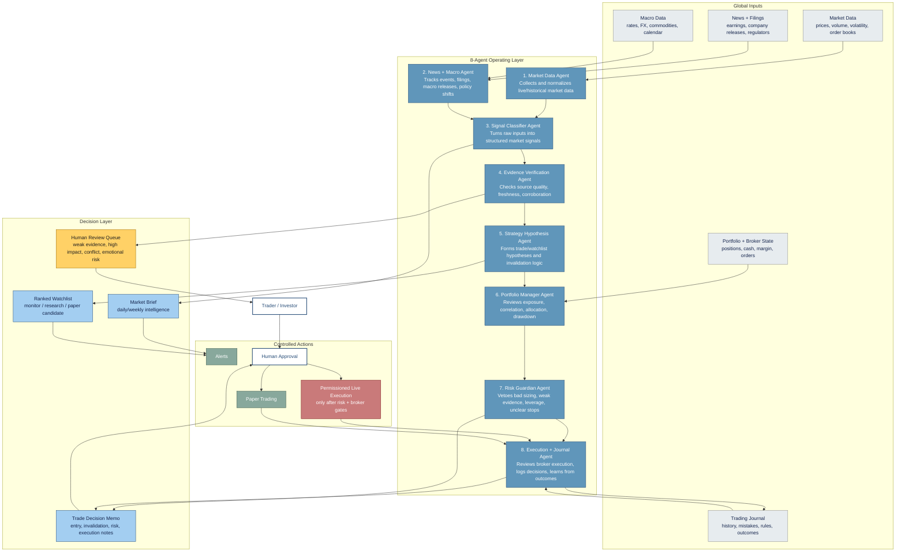

# Chief Market Cat - Ideal Architecture And Build Roadmap

## 1. Blue-Sky Ideal State

Chief Market Cat is an agentic market intelligence and trading decision-support system. It monitors global markets, interprets signals, protects the trader/investor through risk controls, and only escalates trade candidates after evidence, portfolio, and execution checks.

It does not start as an autonomous trader. The ideal state is a supervised investment operating system with optional paper trading and tightly permissioned live execution.



## The 8 Agents And Their Roles

| Agent | Role | Must Not Do |
|---|---|---|
| 1. Market Data Agent | Fetch prices, volume, volatility, liquidity, candles, order book data, and market status. | Interpret news or approve trades. |
| 2. News + Macro Agent | Monitor news, filings, economic calendar, rates, FX, commodities, earnings, central banks. | Treat headlines as verified facts. |
| 3. Signal Classifier Agent | Convert raw inputs into structured signals: trend, breakout, mean reversion, macro shift, event risk. | Set final priority or position size. |
| 4. Evidence Verification Agent | Label evidence quality, freshness, source trust, corroboration, and inference risk. | Hide high-stakes information without review. |
| 5. Strategy Hypothesis Agent | Draft trade/watchlist hypotheses, invalidation, scenario paths, and no-trade conditions. | Call something a trade without risk review. |
| 6. Portfolio Manager Agent | Review exposure, concentration, correlation, cash, drawdown, and portfolio fit. | Optimize one trade while damaging the whole portfolio. |
| 7. Risk Guardian Agent | Veto, reduce, delay, or downgrade ideas based on sizing, leverage, liquidity, stops, and event risk. | Let confidence language override risk controls. |
| 8. Execution + Journal Agent | Review broker/order mechanics, paper/live status, log decisions, evaluate outcomes. | Place live trades without explicit human approval. |

## 2. Phased Build Roadmap

The safest path is to build Chief Market Cat the way CSC is being built: deterministic pipeline first, then agents where loops and judgment actually exist.

```mermaid
timeline
    title Chief Market Cat Build Roadmap

    section Phase 0 - Foundation
      Define trading scope : markets, assets, timeframes, risk rules
      Create schemas : MarketItem, SignalItem, VerifiedSignal, TradeMemo
      Choose data sources : price, news, macro, portfolio

    section MVP 1 - Market Intelligence Brief
      Build fetchers : market data + news/macro
      Normalize data : symbols, time zones, timestamps
      Classify signals : structured JSON, no execution
      Daily brief : top signals, held review items, watchlist
      Pin : MVP 1 = monitoring and decision support only

    section Day 2 - Evidence + Risk Gates
      Add evidence_state : source trust, freshness, corroboration
      Add verify gate : hold weak high-impact signals
      Add risk_guardian : no trade without invalidation and sizing
      Add journal log : every signal and decision saved
      Pin : Day 2 = no live trading, paper candidates only

    section Phase 3 - Paper Trading
      Broker sandbox : paper account integration
      Trade memos : entry, stop, target, risk/reward
      Paper execution : human-approved only
      Outcome tracking : journal, P&L, mistakes, review

    section Phase 4 - Portfolio Layer
      Exposure engine : position, cash, sector, asset class
      Correlation checks : avoid hidden concentration
      Drawdown rules : daily, weekly, portfolio-level stops
      Watchlist scoring : opportunity adjusted for risk

    section Phase 5 - Permissioned Live Execution
      Broker gate : order type, spread, margin, liquidity
      Human approval : explicit click/confirmation required
      Small size only : strict max-loss cap
      Kill switch : disable trading on errors or drawdown

    section Phase 6 - Blue-Sky Multi-Agent System
      Multi-agent orchestration : specialist agents coordinate
      Scenario simulation : macro, volatility, portfolio stress
      Strategy evaluation : rolling performance and regime fit
      Supervised automation : narrow, audited, revocable
```



### Pinned MVP 1

MVP 1 should be a global market intelligence brief and local review dashboard,
not a trading bot.

```text
Goal:
Help the trader know what matters today.

Outputs:
- Local dashboard for reviewing the latest run
- Market regime
- Risk tone
- Top global market moves
- Top 5 structured signals
- Held-for-review signals
- Risk-blocked signals
- Watchlist changes
- No-trade warnings
- Suggested research questions
- Saved Markdown/email brief as backup delivery

Dashboard requirement:
- Persist structured run data before rendering: run summary, scored signals,
  held-for-review signals, risk-blocked signals, and brief metadata.
- Dashboard must clearly separate evidence from interpretation and show a
  "No live trades approved" safety boundary.
- Evaluate an interactive globe that maps signals to market hubs and visualizes
  cross-region or cross-asset relationships. It can be the primary exploration
  surface or an expanded mode within a scan-first command dashboard.
- Globe interactions should support drag, rotation, zoom, signal selection, and
  correlation inspection without hiding held-for-review or risk-blocked states.
- Start local-first; Streamlit or a simple FastAPI/HTML app is enough for MVP 1.

Explicitly excluded:
- live trading
- autonomous execution
- leverage recommendations
- options execution
- portfolio optimization
```

### Pinned Day 2

Day 2 should add evidence and risk gates.

```text
Goal:
Stop weak evidence and bad risk from becoming trade ideas.

Build:
- evidence_state
- verify_signal
- risk_guardian
- review_queue
- decision journal

Outputs:
- Passed signals
- Held signals
- Risk-blocked trade ideas
- Paper-trade candidates only

Explicitly excluded:
- live execution
- autonomous broker actions
- complex multi-agent orchestration
```

## 3. Chief Market Cat Pipeline

```mermaid
flowchart LR
    SCHED["scheduler"]:::stage
    FETCHM["fetch_market_data"]:::stage
    FETCHN["fetch_news_macro"]:::stage
    NORM["normalize"]:::stage
    DEDUP["deduplicate_events"]:::stage
    EVID["evidence_state"]:::gate
    CLASS["classify_signal<br/>LLM structured JSON"]:::llm
    VERIFY["verify_signal<br/>deterministic hold/pass"]:::gate
    RISK["risk_gate<br/>position, leverage, liquidity"]:::risk
    SCORE["score_watchlist"]:::stage
    SUM["summarize_brief<br/>LLM brief"]:::llm
    ALERT["alert_human"]:::output
    PAPER["paper_trade_candidate"]:::output
    JOURNAL["journal_store"]:::store
    REVIEW["human_review_queue"]:::warning

    SCHED --> FETCHM
    SCHED --> FETCHN
    FETCHM --> NORM
    FETCHN --> NORM
    NORM --> DEDUP
    DEDUP --> EVID
    EVID --> CLASS
    CLASS --> VERIFY
    VERIFY -- pass --> RISK
    VERIFY -- hold --> REVIEW
    RISK -- pass --> SCORE
    RISK -- block --> REVIEW
    SCORE --> SUM
    SUM --> ALERT
    SCORE --> PAPER
    ALERT --> JOURNAL
    PAPER --> JOURNAL
    REVIEW --> JOURNAL

    classDef stage fill:#e7ecef,stroke:#274c77,color:#13234b;
    classDef llm fill:#6096ba,stroke:#274c77,color:#ffffff;
    classDef gate fill:#a3cef1,stroke:#274c77,color:#13234b;
    classDef risk fill:#c97a7a,stroke:#7f1d1d,color:#ffffff;
    classDef output fill:#88a89c,stroke:#3d5a4e,color:#ffffff;
    classDef warning fill:#ffd166,stroke:#9a6700,color:#1e1e1e;
    classDef store fill:#ffffff,stroke:#8b8c89,color:#13234b;
```



## Pipeline Contracts

### Raw Market Item

```json
{
  "id": "",
  "asset": "",
  "market": "",
  "timestamp": "",
  "source": "",
  "source_type": "price|news|macro|filing|broker|manual",
  "trust_tier": "official|primary|major_publisher|market_data|aggregator|social",
  "title": "",
  "body": "",
  "raw_metadata": {}
}
```

### Signal Item

```json
{
  "asset": "",
  "timeframe": "",
  "signal_type": "trend_continuation|breakout|mean_reversion|macro_shift|event_risk|liquidity_stress|no_trade",
  "direction": "bullish|bearish|neutral|unclear",
  "evidence": [],
  "confidence": 0.0,
  "invalidation": "",
  "risk_flags": []
}
```

### Trade Memo

```json
{
  "asset": "",
  "direction": "",
  "timeframe": "",
  "thesis": "",
  "entry_zone": "",
  "invalidation": "",
  "stop": "",
  "target": "",
  "position_size_logic": "",
  "max_loss": "",
  "execution_notes": "",
  "decision": "monitor|research_deeper|paper_trade_candidate|live_candidate_human_approval_required|reject"
}
```

## Suggested First Repo Shape

```text
chief-market-cat/
  cmc/
    schemas/
      items.py
      signals.py
      trades.py
      runs.py
    connectors/
      market_data_connector.py
      news_connector.py
      macro_calendar_connector.py
      broker_state_connector.py
    pipeline/
      fetch_market_data.py
      fetch_news_macro.py
      normalize.py
      deduplicate_events.py
      evidence_state.py
      classify_signal.py
      verify_signal.py
      risk_gate.py
      score_watchlist.py
      summarize_brief.py
      journal_store.py
    prompts/
      signal_classifier_prompt.txt
      market_brief_prompt.txt
    storage/
      jsonl_store.py
    tests/
  config/
    sources.yaml
    pipeline.yaml
    risk.yaml
  docs/
    adr/
    architectures/
  CONTEXT.md
```

## Design Motto

```text
CSC finds external strategic signals.
CDC finds internal customer signals.
CMC finds market signals, but Risk Guardian decides whether they are tradable.
```
